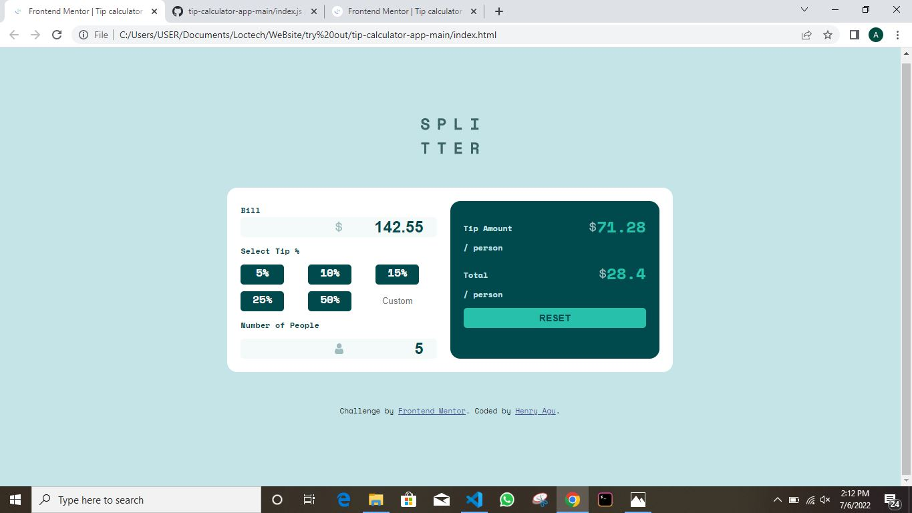
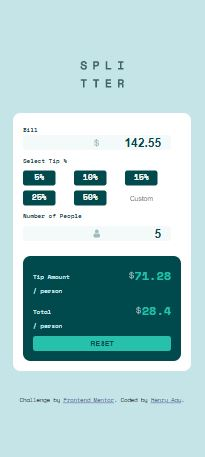

# Frontend Mentor - Tip calculator app solution

This is a solution to the [Tip calculator app challenge on Frontend Mentor](https://www.frontendmentor.io/challenges/tip-calculator-app-ugJNGbJUX). Frontend Mentor challenges help you improve your coding skills by building realistic projects.


## Table of contents

- [Overview](#overview)
  - [The challenge](#the-challenge)
  - [Screenshot](#screenshot)
  - [Links](#links)
  - [Built with](#built-with)
  - [What I learned](#what-i-learned)
- [Author](#author)


## Overview

### The challenge

Users should be able to:

- View the optimal layout for the app depending on their device's screen size
- See hover states for all interactive elements on the page
- Calculate the correct tip and total cost of the bill per person

### Screenshot





## How To Use The Tip calculator

- Firstly input the Bill amount.
- Input number of people you want to split among.
- Finally, select a percentage.


### Links

- Solution URL: [Add solution URL here](https://your-solution-url.com)
- Live Site URL: [Add live site URL here](https://your-live-site-url.com)


### Built with

- Semantic HTML5 markup
- CSS custom properties
- Flexbox
- CSS Grid
- Mobile-first workflow
- javaScript

### What I learned

I was able to use a single functions to run different tasks simultaneously...


```js
function forFiftyPercent(){
    let bill = document.getElementById('bill').value;
    const FiftyPercent = ((50/100)* bill).toFixed(2);
    
    tipAmount.innerHTML = FiftyPercent

    let numberOfPeople = document.getElementById('no_of_people').value;
    const billForPersons = parseInt(bill) / parseInt(numberOfPeople);

    perPerson.innerHTML = billForPersons
}

```

## Author

- Frontend Mentor - [@HenryAgu](https://www.frontendmentor.io/profile/HenryAgu)
- Twitter - [@_henryi](https://www.twitter.com/_henryi)


